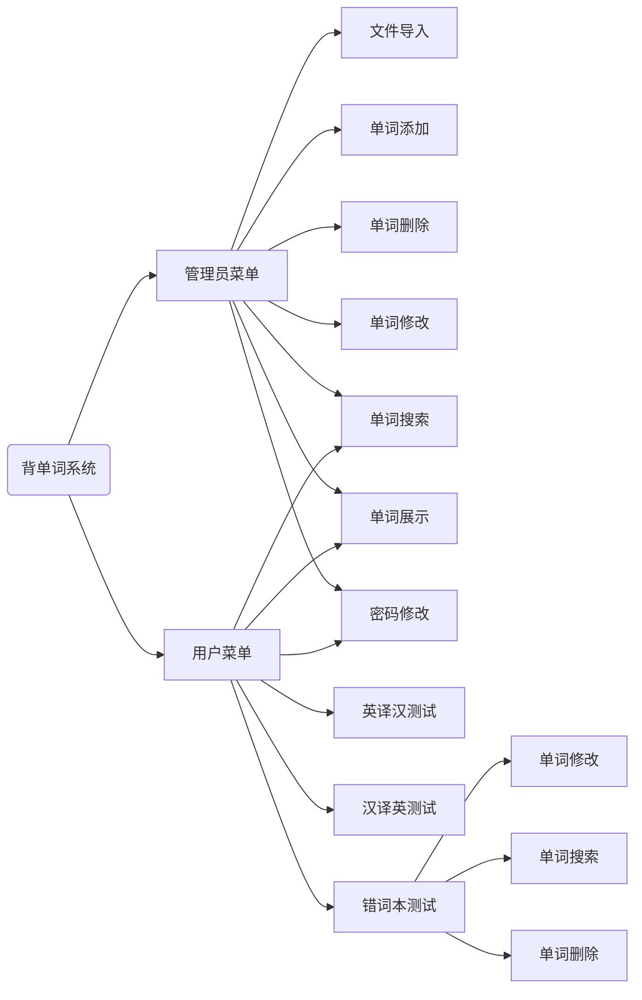

# 背单词系统

## 流程图

```mermaid
graph LR

Sys(背单词系统) --> Admin[管理员菜单]
Sys --> User[用户菜单]

Admin --> 文件导入
Admin --> 单词添加
Admin --> 单词删除
Admin --> 单词修改
Admin --> 单词搜索
Admin --> 单词展示

Admin --> 密码修改
User --> 密码修改

User --> 单词搜索
User --> 单词展示
User --> 英译汉测试
User --> 汉译英测试
User --> 错词本测试

错词本测试 --> e[单词修改]
错词本测试 --> s[单词搜索]
错词本测试 --> d[单词删除]
```

## 账号管理

账号文件保存于 `account.csv`，初次运行检测不到该文件将会创建，并写入默认管理员用户名和密码（`admin`, `admin`）

密码使用 SHA512 加密保存
