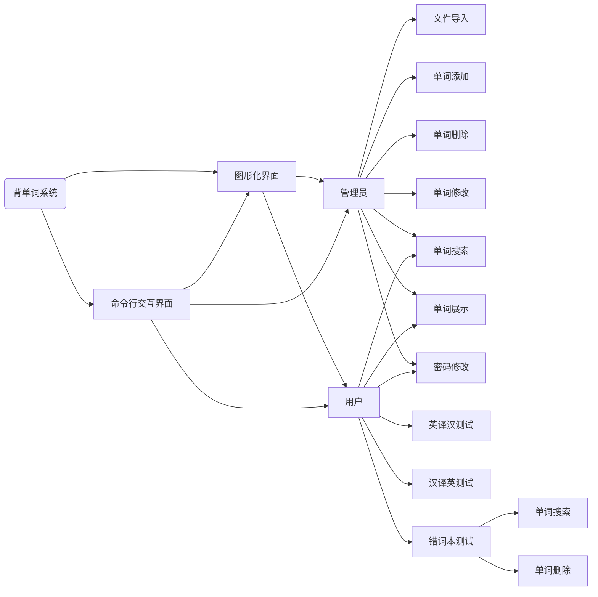

# 背单词系统

## 流程图



## 运行

```shell
python -m pip install -r requirements.txt # 安装依赖
python __init__.py
```

## 构建

```shell
python -m pip install --upgrade pip
python -m pip install -r requirements.txt # 安装依赖
python -m pip install nuitka # 安装nuitka来构建
python -m nuitka --onefile --standalone --enable-plugin=pyqt5 --output-dir=build __init__.py # 构建
```
